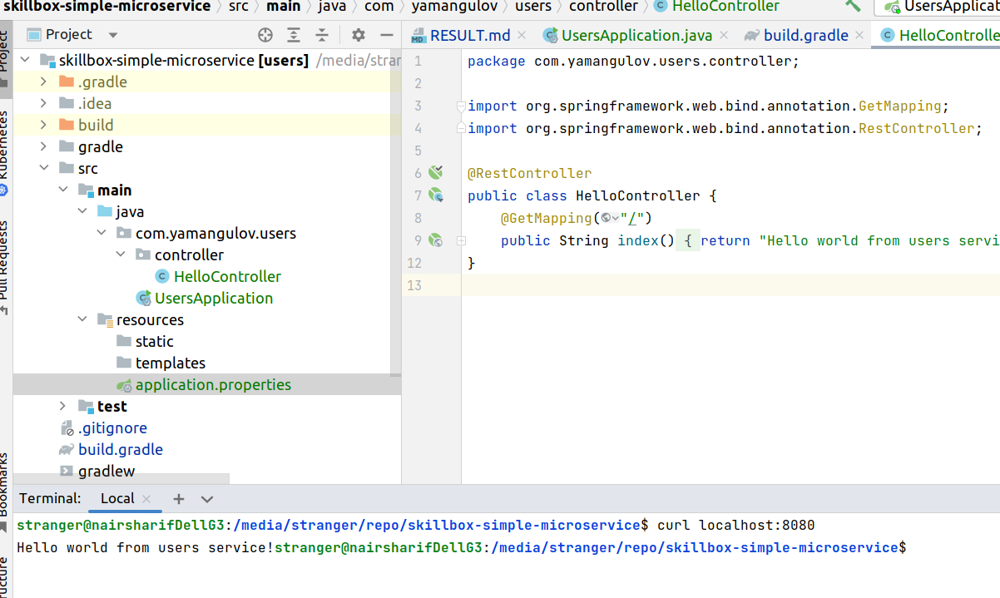

В задании пропущено добавление зависимости implementation 'com.h2database:h2:2.1.214' без которой Spring Web+Spring JPA не соберет приложение, а выдаст ошибку (можно добавить настройки любой другой БД, которая будет использоваться в проекте). После добавления результат запроса в консоли:

